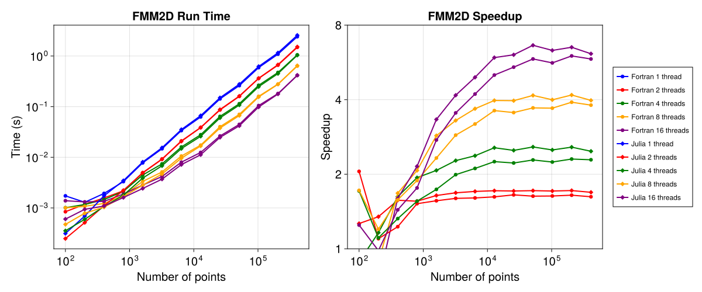
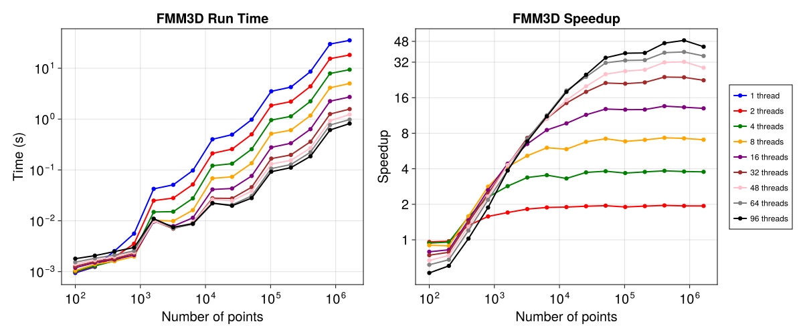

# Benchmarking FMM2D and FMM3D

Mainly benchmarking the Julia interface of FMM2D and FMM3D.

## FMM2D 

Both Fortran and Julia wrapped versions are benchmarked, on an Intel(R) Xeon(R) Gold 6234 CPU @ 3.30GHz with 16 physical cores.

## FMM3D

Only the Julia wrapped version is benchmarked, on two AMD EPYC 9474F 48-Core Processor, 96 physical cores in total.

